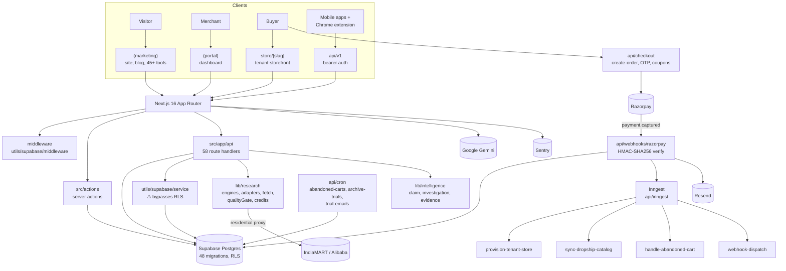
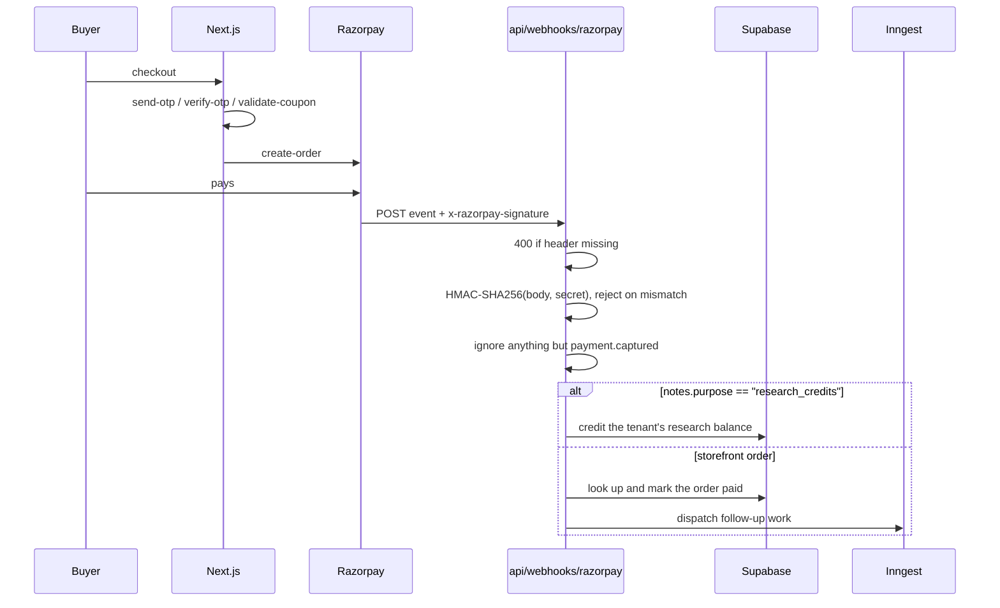
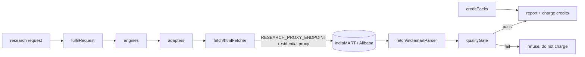
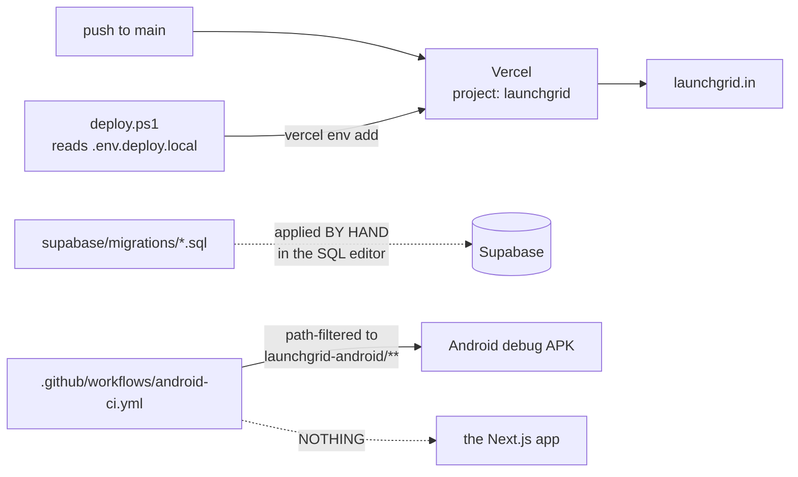

# Architecture

Verified against the source and a successful production build on 2026-09-30.
Every component named here exists.

## System Overview

A Next.js 16 App Router application on Vercel, backed by Supabase, with Inngest
for background work and Razorpay for payments. It serves three audiences from one
codebase: a public marketing site, a merchant portal, and per-tenant storefronts —
plus a versioned API for the mobile apps and the Chrome extension.

## Frontend

Next.js 16 App Router with three route groups:

- **`(marketing)`** — blog, FAQ, pricing, discover, join, support, free-setup,
  onboarding (+ provisioning), research, sell-online, three competitor comparison
  pages, and **45+ calculator/tool pages** (7 bespoke routes plus 41 generated via
  `generateStaticParams` from `src/data/tools.ts`).
- **`(portal)`** — the merchant dashboard: orders, products (add/edit/import),
  customers, coupons, marketing, ads, research, investigate, seo, settings
  (+ payments), extension and extension-auth.
- **`store/[slug]`** — tenant storefronts: shop, product, checkout, invoice,
  track, policies, and a per-store `sitemap.xml`.

Plus `apps/<slug>/` serving privacy-policy and delete-account pages for **nine**
mobile apps — adfree-applock, gst-sahayak, kinly, nyayai, whatsapp, medicine,
periods, snapdue, water. This is where the sibling mobile projects' legal pages live.

Stack: React 19, Tailwind v4, shadcn + `@base-ui/react`, `framer-motion`,
`lucide-react`. 86 files under `src/components/`.

> ⚠️ `AGENTS.md` warns that this Next.js version differs from most training data
> and instructs reading `node_modules/next/dist/docs/` before writing code.

## Backend

There is no separate backend service. Server work happens in three places:

| Mechanism | Location | Use |
|---|---|---|
| Route handlers | `src/app/api/` — 58 files | HTTP APIs, webhooks, cron |
| Server actions | `src/actions/` — 7 modules | checkout, investigation, missions, onboarding, portal, research, researchCredits |
| Background jobs | `src/inngest/functions.ts` — 4 functions | long-running and retryable work |

Pure, testable logic lives in `src/lib/` (72 files) and is where all 163 tests
point.

## Payments flow

Two caveats on this path are recorded in `.ai/PROJECT_STATUS.md` — the hardcoded
secret fallback and the non-constant-time comparison.

## Database

**Supabase Postgres**, multi-tenant on `tenant_id`, **48 migrations** from
`0000_initial_schema.sql` to `0045_order_payment_reference.sql`.

Broad areas by migration: storefronts and products, orders and payments,
compliance policies, referrals, abandoned carts, coupons, auth/profile sync,
UPI QR and a fee ledger, social posts, and — the largest cluster — research
(usage, provenance, batching, marketplace listings, account credits, free-tier
limits, credit packs, supplier contacts, fair-use caps, an evidence store,
investigations, early access).

RLS is in use; `0028_fix_public_demo_leak.sql` shows it is actively maintained.

**Migrations are applied by hand** in the Supabase SQL editor. Nothing verifies
the live schema matches the folder, and two migrations share the `0001_` prefix.

## Authentication

Supabase Auth, with helpers in `src/utils/supabase/`:

| File | Role |
|---|---|
| `client.ts` | browser client |
| `server.ts` | SSR client |
| `service.ts` | **service-role client — bypasses RLS, server-only** |
| `middleware.ts` | session refresh |
| `bearer.ts` | bearer-token auth for `api/v1` (mobile + extension) |
| `queries.ts` | shared queries |

## Entitlements

`src/lib/plans.ts` is the declared single source of truth: a `PlanTier` union
(`free` | `starter` | `pro` | `premium`, legacy DB naming) mapped to a typed
`PlanFeatures` interface (`max_products`, `max_stores`, `custom_domain`,
`included_custom_domains`, `additional_custom_domain_setup_fee`,
`whatsapp_recovery`, `email_recovery`, `razorpay_byok`, …). Served to web and
mobile alike through `api/v1/entitlements`.

## Research subsystem

The most heavily tested part of the codebase.

`.env.example` explains the proxy requirement well: supplier directories block
datacenter IPs (IndiaMART returns 429, Alibaba a CAPTCHA), the endpoint is a
template so the vendor is swappable, and the app **refuses to start fulfilment
without them rather than silently delivering empty reports**.

`qualityGate.ts` enforces the commercial guarantee — its tests assert it "fails an
empty harvest rather than charging for it" and "REFUSES a report whose suppliers
sell something else".

## External Services

| Service | Purpose |
|---|---|
| Supabase | Postgres, auth, storage |
| Razorpay | Payments and webhooks (India) |
| Inngest | Background jobs |
| Resend | Transactional email |
| Sentry | Error tracking |
| Google Gemini | Generative features (ads, social posts, coach insights) |
| Residential proxy (ScraperAPI / Bright Data) | Research fulfilment egress |
| Vercel | Hosting |

## Deployment Architecture

**CI covers only the Android subproject.** The web app — live in production — has
no lint, typecheck, test or build check in CI. That is P1 in `.ai/TODO.md`.

`deploy.ps1` sets Vercel environment variables. As of 2026-09-30 it reads them
from a git-ignored `.env.deploy.local`; before that it had them hardcoded.

## Sibling subprojects in this repository

| Folder | What it is | CI |
|---|---|---|
| `launchgrid-android/` | Android app | ✅ own workflow |
| `launchgrid-extension/` | Chrome extension | ❌ |
| `launchgrid-ads/` | Remotion-based ad video generation | ❌ |

None was audited in depth on 2026-09-30.

## Important Dependencies

`next@16.2.7`, `react@19.2.4`, `@supabase/supabase-js`, `@supabase/ssr`,
`inngest`, `resend`, `@sentry/nextjs`, `@google/genai`, `jose`,
`@base-ui/react`, `shadcn`, `framer-motion`, `lucide-react`,
`class-variance-authority`, `clsx`, `tailwind-merge`, `tw-animate-css`.

Dev: `tailwindcss@4`, `@tailwindcss/postcss`, `eslint@9`, `eslint-config-next`,
`typescript`, `pg`.

**No test framework dependency** — tests use Node's built-in runner with a custom
TypeScript loader at `tests/resolve-ts.mjs`.
